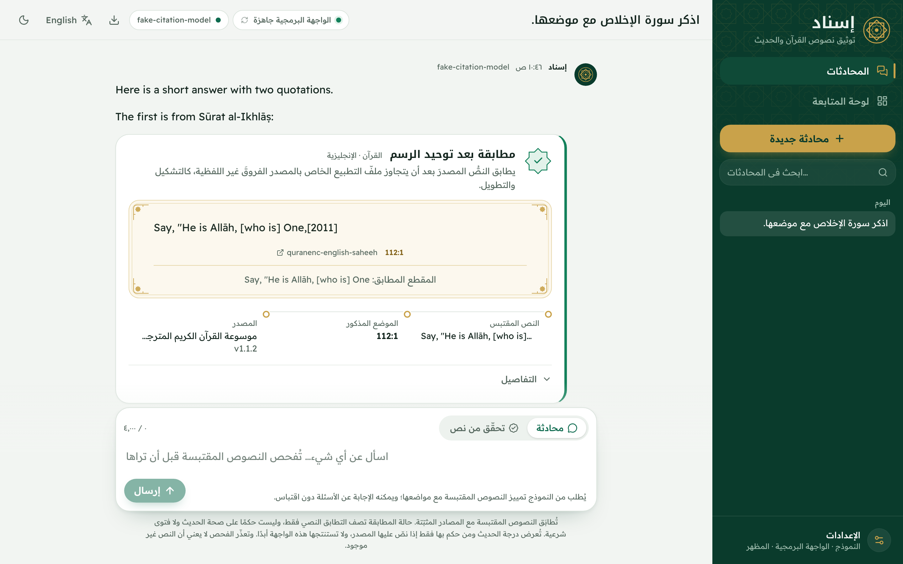
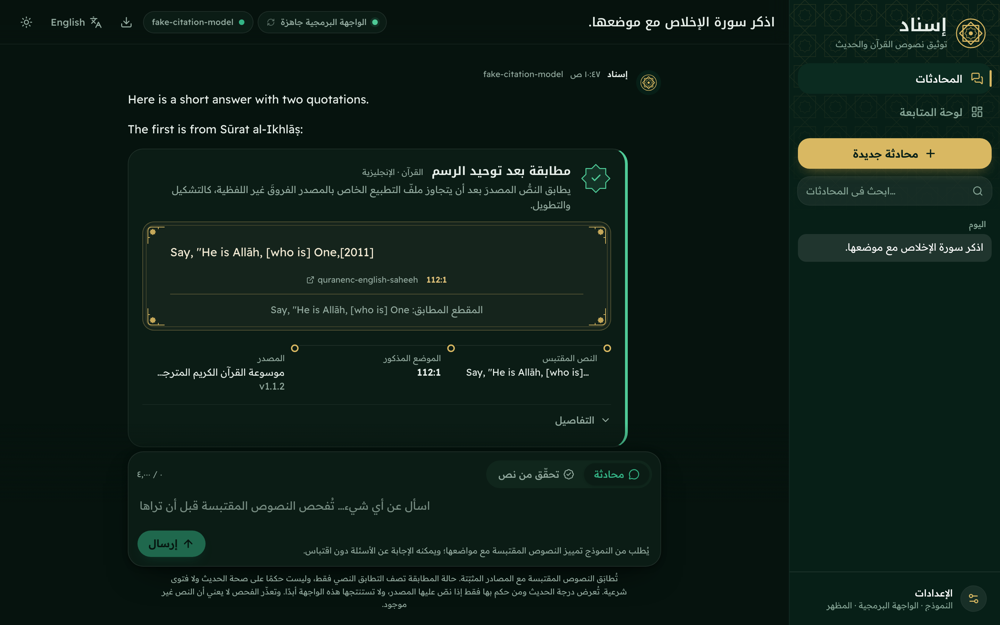
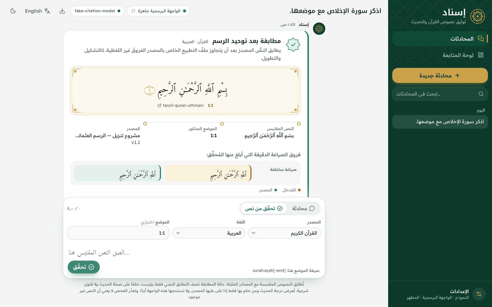
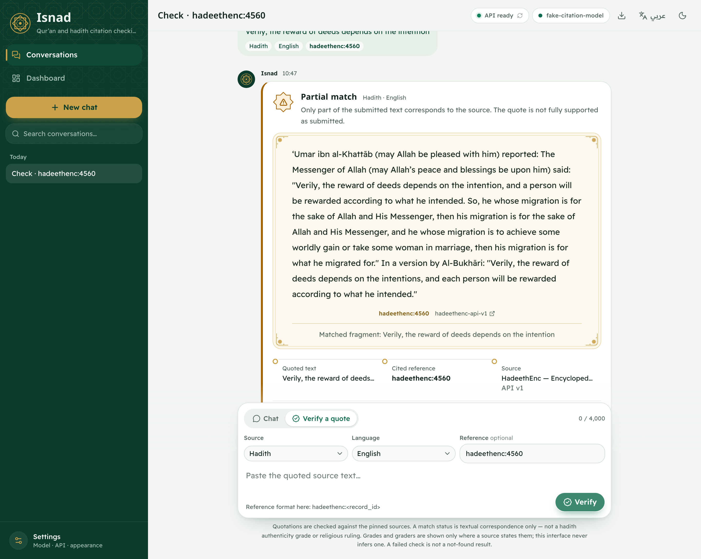
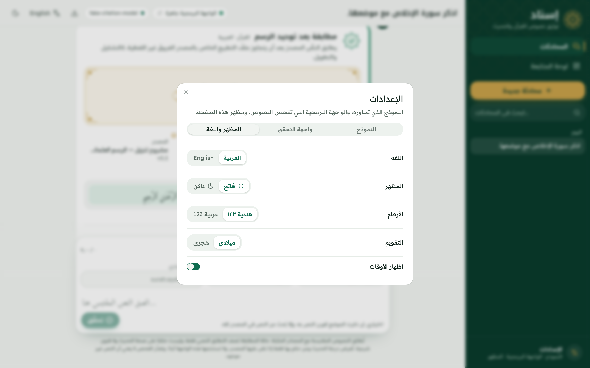
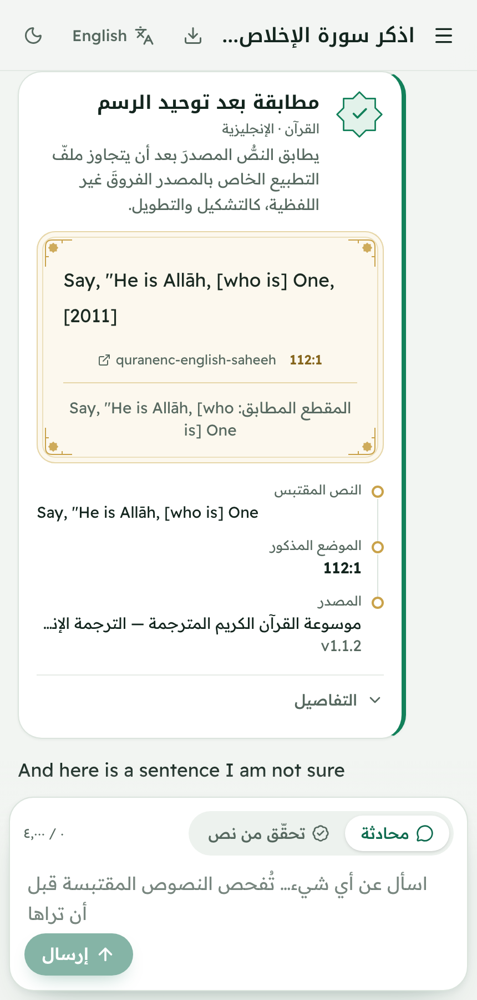
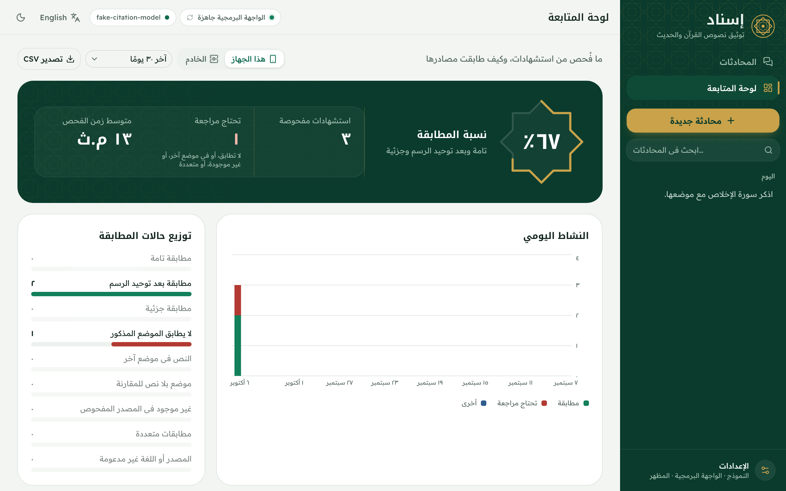
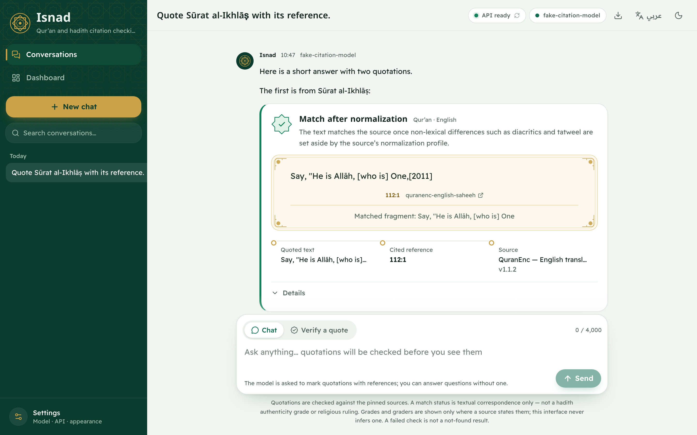

# Isnad Core

Verification of Qur'an and hadith citations, in Arabic and English, against pinned sources.

A citation is a quotation plus a reference. Isnad Core looks the quotation up in the edition that was pinned for that source and language, and answers with one match status, the source wording verbatim, the exact wording differences, and the provenance of the edition that supplied it. The status measures textual correspondence only: it says whether the wording appears at that reference in that edition, and nothing about authenticity or religious ruling.

The repository contains the verification engine, a REST and WebSocket API, an MCP server, a LiteLLM guardrail adapter, an agent skill, and a browser interface that chats with a user-configured model while checking every quotation the model marks before it is shown.

## Screenshots

The interface (Next.js, in `web/`) opens in Arabic, right to left; English is one click away in the header and in Settings. The design ("Emerald & Gold") frames the app in deep emerald with a gold geometric lattice, uses emerald for actions, gold for ornament only, and ivory in one place: behind Qur'an and hadith text, set like a mushaf page. Every checked quotation carries a seal (an eight-pointed khatam in the result's colour) and its chain of checking: the submitted text, the reference, and the pinned edition that answered. Headings use Noto Kufi Arabic, the interface Readex Pro, source text Amiri Quran; the fonts are built into the site, so the page asks nothing of a third party at runtime.

Chat: prose streams as it arrives; each marked quotation is held, checked, and then rendered as its own card where the model wrote it.



Dark theme, same conversation.



Hand check without a model, Qur'an Arabic: `normalized_match`, with the Tanzil wording set as in a mushaf, the version, licence and checksum.



Hand check in the English interface, hadith English: `partial_match` with the HadeethEnc record, its coverage note, and the source-supplied grade kept separate from the match status.



Settings: language, theme, numerals (Arabic-Indic or Western) and calendar (Gregorian or Hijri).



Narrow layout.



Dashboard (`#/dashboard`): citations checked, match rate, citations that need review, check time, status distribution, daily activity, sources and languages, source health, and the flagged citations with a link back to each conversation. "This device" reads the browser's saved history; "Server" reads `GET /v1/stats`, which counts results without storing any quotation or reference and is off unless `ISNAD_STATS_ENABLED=1`.



The English interface.



`scripts/capture_screenshots.py` produces these images from a running build and the real API, so they match the code in the repository.

## Sources

| Edition | Language | Source type | Delivery |
| --- | --- | --- | --- |
| Tanzil Uthmani 1.1 | `ar` | Qur'an | Packaged with the project, pinned by SHA-256 |
| QuranEnc `english_saheeh` 1.1.2 | `en` | Qur'an translation | Packaged with the project, pinned by SHA-256 |
| HadeethEnc official API v1 | `ar`, `en` | Hadith | Remote, queried per request |

Provenance (edition name, version, licence, URL, content checksum where available, and coverage notes) is returned with every result. The HadeethEnc edition is a curated selection, not a comprehensive hadith corpus, and every hadith result carries that coverage note. Attribution and terms of use are recorded in `NOTICE.md`.

## Match statuses

| Status | Meaning |
| --- | --- |
| `exact_match` | The submitted text equals the source wording at the cited reference. |
| `normalized_match` | The text matches after the source's normalization profile sets non-lexical differences aside. |
| `partial_match` | Only part of the submitted text corresponds to the source. |
| `mismatch_at_cited_reference` | The cited reference exists but does not contain the submitted wording. |
| `quote_found_wrong_reference` | The wording is in the edition, at a different reference. |
| `reference_found_without_quote` | The reference exists; no quoted text was submitted for comparison. |
| `not_found_in_checked_corpus` | The bounded edition that was searched does not contain the wording. |
| `ambiguous_multiple_matches` | More than one location matched; the result cannot be reduced to one reference. |
| `unsupported_source_or_language` | No adapter is configured for this source and language pair. |

`GET /v1/capabilities` is the runtime source of truth for the statuses, editions, limits, and markers in force for a deployment.

## Repository layout

| Path | Contents |
| --- | --- |
| `src/isnad_core/engine.py` | Verification engine: routes a request to the adapter for its source and language |
| `src/isnad_core/normalization.py` | Normalization profiles and bounded candidate search |
| `src/isnad_core/quran/` | Tanzil corpus loader, QuranEnc English adapter, Qur'an reference parsing |
| `src/isnad_core/hadith/` | HadeethEnc client and adapter, source-local reference parsing |
| `src/isnad_core/streaming.py` | Fail-closed streaming gate for marked citation blocks |
| `src/isnad_core/prompt.py` | The citation protocol prompt and its version |
| `src/isnad_core/api/` | FastAPI application: REST, WebSocket, served interface, schemas, middleware |
| `src/isnad_core/integrations/` | MCP server and LiteLLM guardrail adapter |
| `web/` | The interface: Next.js (App Router, static export), TypeScript, Tailwind CSS and shadcn/ui. `npm run export` builds it into `src/isnad_core/api/web/`, which the API serves at `/` |
| `frontend/` | The classic single-file interface, served at `/classic` and offered as an offline download; its `citation_stream.js` is shared with `web/` |
| `tests/` | Contract, evidence, streaming, prompt, provider-pipeline, and browser tests |
| `scripts/` | Verification suite, source ingest, synthetic evaluation, secret scan, screenshot capture |
| `docs/` | API contract, integrations, evaluation notes, screenshots |
| `evaluation/reports/` | Generated evaluation reports |
| `skills/isnad-citation-verification/` | Agent instruction for hosts that load skills |

## Developing the interface

The API serves the committed static export, so running Isnad needs no Node toolchain. To change the interface:

```bash
cd web
npm install
NEXT_PUBLIC_ISNAD_API_BASE=http://127.0.0.1:8000 npm run dev   # against a running API (CORS allows localhost:3000)
npm run lint && npm run typecheck
npm run export   # builds web/out and copies it into src/isnad_core/api/web/
```

`web/src/lib/i18n/messages.ts` holds every interface string in Arabic and English under the same keys as the classic interface, and `tests/test_web.py` checks that both languages carry the same keys. The citation streamer is copied from `frontend/citation_stream.js` before every build, and a test fails if the two differ.

## Install and run

```bash
python -m venv .venv && . .venv/bin/activate     # Windows: .venv\Scripts\activate
python -m pip install -e '.[dev]'

uvicorn isnad_core.api.app:app --host 127.0.0.1 --port 8000
```

- Interface: <http://127.0.0.1:8000/>
- OpenAPI: <http://127.0.0.1:8000/docs>

Verify one citation with curl:

```bash
curl -s http://127.0.0.1:8000/v1/verify \
  -H 'content-type: application/json' \
  -d '{"source_type":"quran","language":"ar","quote":"بِسْمِ ٱللَّهِ ٱلرَّحْمَـٰنِ ٱلرَّحِيمِ","reference":"1:1"}'
```

Run the full check suite — compile, lint, format, tests, packaging, and secret scan:

```bash
bash scripts/verify.sh
```

## HTTP API

| Method | Path | Purpose |
| --- | --- | --- |
| `GET` | `/v1/capabilities` | Supported sources and languages, statuses, limits, streaming contract, prompt path |
| `GET` | `/v1/system-prompt` | The versioned citation protocol prompt and its block markers |
| `POST` | `/v1/verify` | Verify one citation |
| `GET` | `/health/live` | Process liveness |
| `GET` | `/health/ready` | Registered adapters and loaded editions |
| `GET` | `/`, `/gui` | The interface, with a Content-Security-Policy header |
| `GET` | `/gui/standalone.html` | The same interface as a downloadable single file |
| `WS` | `/v1/stream` | Streaming gate: emits prose and per-citation lifecycle events |

Request fields, response schema, error codes, limits, and origin rules are documented in [`docs/api-contract.md`](docs/api-contract.md).

## Using the interface

Chat mode:

1. Start the API and open `/` (the dashboard is at `/dashboard/`; the classic single-file interface stays at `/classic`).
2. Open **Settings → Model**. Choose a provider preset or "Other OpenAI-compatible endpoint", set the base URL and model name, and enter a key if the provider requires one.
3. Send a message. Prose streams immediately. A quotation the model marks with the citation protocol is held, verified through `POST /v1/verify`, and then shown as a card with the source wording, the reference, the status, and the provenance. Text that is not a marked quotation streams untouched.

The key is held in the tab's memory by default and forgotten on reload. Ticking "remember the key on this device" writes it to this browser's local storage in readable form.

Verify mode ("Verify a quote") checks a quotation without any model: paste the quoted text, a reference, or both. Omitting the reference searches the edition for the wording; supplying one checks that specific locator and is what allows `mismatch_at_cited_reference` and `quote_found_wrong_reference`.

Deployment settings:

| Variable | Effect |
| --- | --- |
| `ISNAD_CORS_ORIGINS` | Comma-separated origins allowed to call the API from a browser |
| `ISNAD_GUI_FRAME_ANCESTORS` | Optional `frame-ancestors` value for the served page; the default omits it |
| `ISNAD_DEFAULT_LOCALE` | `en` (default) or `ar`: language of human-readable API text when a request sets neither `?lang=` nor `Accept-Language` |
| `ISNAD_STATS_ENABLED` | `1` enables `GET /v1/stats` (aggregate counts only); off by default because the service has no authentication |
| `ISNAD_STATS_PATH` | Optional JSON file that keeps those counters across restarts |

### Model endpoints

Any OpenAI-compatible `POST {base}/chat/completions` endpoint that supports `stream: true` works. Presets cover OpenAI, OpenRouter, Groq, Ollama, and a local LiteLLM proxy.

A provider that refuses browser requests needs a proxy in front of it; LiteLLM with `examples/litellm_config.yaml` is one. The page sends the model key only to the endpoint configured above.

A scripted, streaming-only test double is included for exercising the chat path without a provider account:

```bash
python examples/fake_openai_provider.py --port 8123
# Model settings: "Other OpenAI-compatible endpoint",
# base URL http://127.0.0.1:8123/v1, model name fake-citation-model
```

It replies with a fixed answer containing one quotation the pinned corpus contains and one it does not, in chunks small enough to split the citation markers. Its quotations are verified exactly like a real model's.

## Integrations

| Surface | Install | Entry point |
| --- | --- | --- |
| MCP server | `python -m pip install 'isnad-core[mcp]'` | `isnad-mcp` (stdio); tools `verify_citation`, `isnad_capabilities` |
| LiteLLM guardrail | `python -m pip install 'isnad-core[litellm]'` | `isnad_core.integrations.litellm_guardrail.IsnadCitationGuardrail` |
| Agent skill | Copy `skills/isnad-citation-verification/` into the host's skill directory | `SKILL.md` |
| Browser interface | Served by the API, or `isnad-gui.html` from `/gui/standalone.html` | `frontend/` sources |

All surfaces call the same verification engine and return the same fields; none implements its own matcher. [`docs/integrations.md`](docs/integrations.md) documents the streaming behaviour, the `isnad_event` extension the LiteLLM hook adds, and the limits of each surface.

## Tests

`bash scripts/verify.sh` runs the whole suite: 124 tests, lint, format, byte-compile, a wheel build that checks the pinned corpus data is packaged, and a credential scan.

| Area | Test file |
| --- | --- |
| REST contract, evidence, errors, CORS | `tests/test_api.py`, `tests/test_api_middleware.py` |
| Engine routing and normalization | `tests/test_engine.py`, `tests/test_normalization.py` |
| Qur'an and hadith adapters | `tests/test_quran_verifier.py`, `tests/test_quran_english_verifier.py`, `tests/test_hadeethenc.py` |
| Pinned data integrity | `tests/test_data_integrity.py`, `tests/test_quranenc_integrity.py` |
| Streaming gate | `tests/test_streaming.py` |
| Citation protocol prompt | `tests/test_system_prompt.py` |
| Browser streamer | `tests/test_citation_stream_js.py` |
| Provider → gate → verifier pipeline | `tests/test_fake_provider_pipeline.py` |
| Served interface markup and build drift | `tests/test_api_gui.py` |
| Web interface serving, export, catalog parity | `tests/test_web.py` |
| Web interface in a real browser (optional) | `tests/test_web_browser.py` |
| Interface strings, Arabic plurals and search | `tests/test_i18n_js.py` |
| Real browser behaviour (optional) | `tests/test_gui_browser.py` |
| Credential scan | `tests/test_secret_scan.py` |

The browser tests need the `browser` extra and a Chromium install; they skip where either is absent:

```bash
python -m pip install 'isnad-core[browser]'
python -m playwright install chromium
```

## Evaluation

```bash
python scripts/evaluate_synthetic.py --output evaluation/reports/report.json
```

The harness measures normalization and matching behaviour on controlled same-source cases: for each case it asserts the expected status, so a regression in normalization or candidate search fails the run. It is not field evidence of citation accuracy on real-world text. [`docs/evaluation.md`](docs/evaluation.md) describes the cases and the reported fields.

## Limitations

- Match status is textual correspondence in one edition. It is not a hadith grade, an authenticity determination, or a religious ruling, and no grade or grader is inferred, only repeated when the source states one.
- The hadith edition is a curated selection. `not_found_in_checked_corpus` is bounded to it.
- HadeethEnc is a remote dependency. An outage returns `503` with `code = "source_unavailable"` and is never converted into a not-found result.
- The LiteLLM adapter is unit-tested against the pinned LiteLLM response model; end-to-end SSE serialization through a running proxy is a deployment step that this repository has not verified.
- The interface streams from the model endpoint in the browser and verifies through REST. It does not consume the WebSocket gate stream or the LiteLLM `isnad_event` extension.
- The interface is a reference client. CORS allow-lists are not authentication; deploy it behind your own authentication boundary.

## Licence and attribution

Code is licensed under the terms in [`LICENSE`](LICENSE). Source editions keep their own terms; see [`NOTICE.md`](NOTICE.md) for Tanzil, QuranEnc, and HadeethEnc attribution, versions, and licence notes.
